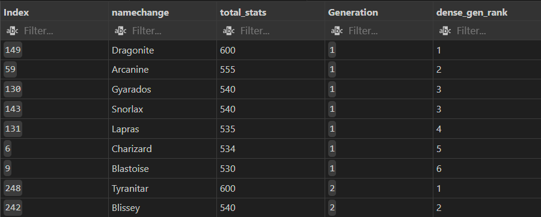
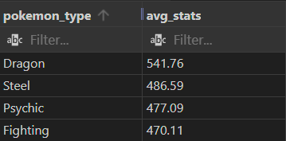
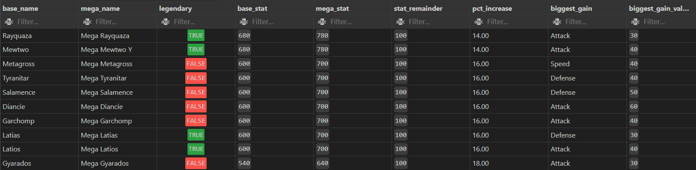

# Pokemon SQL Analysis

## Overview
This project explores the Pokemon pokedex using advanced SQL techniques to clean, transform, and analyze Pokemon data. The dataset was retrieved on [Kaggle](https://www.kaggle.com/datasets/mlomuscio/pokemon?select=PokemonData.csv) with the results being visualized on DBeaver outputs and tables to provide insights into Pokemon balance, team building, and type power levels. 

## 📈 The Dataset 
The dataset contains the following columns:
- Num
- Name
- Type1
- Type2
- HP
- Attack
- Defense
- SPAtk
- SPDef
- Speed
- Generation
- Legendary

## 🔧 Tools 
- pgAdmin 4
- DBeaver
- VS code
- GitHub

## 🧼 Data Cleaning
- **Purpose:** Cleaning was critical as when analyzing the original dataset it was evident there were issues regarding the naming convention for each pokemon. Pokemon who had mega evolution had repetitions in their name:

    | Name | Name Change | 
    | :------- | :------: | 
    | CharizardMega Charizard | Mega Charizard | 
    | HoopaHoopa Confined  | Hoopa Confined  | 
    | MeowsticMale  | Meowstic Male  |  
- Upon observation there are several issues with the naming convention involving mega evolutions and non-/legendary pokemon with different forms. 
- To resolve the issue I created a view that could be used in the beginning of each analysis.
- Using a CASE statement, pokemon with 'Mega' in the name used a substring() function to remove the base name. Where as regex_replace() was used as the exact position of the second word was never the same. regex_replace() was additionally used to add spaces when a capital letter would appear in the same string when there was no space.
```
WHEN p."Name" LIKE '%Mega%' THEN substring(p."Name" FROM POSITION('Mega ' IN p."Name"))

WHEN p."Name" LIKE 'Kyogre%' AND length(p."Name") > length('Kyogre') THEN regexp_replace(p."Name", 'Kyogre', '', 1, 1)

WHEN p."Name" ~ '[a-z][A-Z]' THEN regexp_replace(p."Name", '([a-z])([A-Z])', '\1 \2', 'g')
```
- The Legendary column was update to properly set some mythical pokemon from TRUE to FALSE and add in a Mythical pokemon column for proper analysis
```
	CASE 
		WHEN p."Name" IN ('Mew', 'Celebi', 'Jirachi', 'Manaphy', 'Phione', 'Darkrai', 'Arceus', 'Victini', 'Genesect', 'Volcanion')
			OR p."Name" LIKE 'Deoxys%'
			OR p."Name" LIKE 'Shaymin%'
			OR p."Name" LIKE 'Keldeo%'
			OR p."Name" LIKE 'Meloetta%'
			OR p."Name" LIKE 'Diancie%'
			OR p."Name" LIKE 'Hoopa%'		
		THEN TRUE
		ELSE FALSE
	END AS Mythical
```
## 📊 Analysis
1. What is the Highest Stat per Generation?
- **Purpose:** Determine the top 6 Pokemon per generation, excluding legendary and mega evolution pokemon, to determine the strongest team from total stats.
- **Techniques Used:** 
    - CTEs (WITH) to determine the top pokemon
    - SUM() aggregation to calculate the total stat of each pokemon
    - Filter with WHERE for Legendary = FALSE and Name does not contain '%Mega%'
    - CTE, ranked_pokemon uses a DENSE_RANK() window function to rank each pokemon by total stats within each generation
    ```
    DENSE_RANK() OVER (PARTITION BY "Generation" ORDER BY total_stats DESC) AS dense_gen_rank
    ```
    - **Note:** DENSE_RANK() was used instead of RANK() as some pokemon had equal total stats, since the game is to build a team of 6 the dense_rank() allowed for better customization for the users team.


- **Interpretation:** Each generation contains "pseudo-legendary" Pokemon like Dragonite, Garchomp, Metagross, etc. This highlights strong pokemon options in each game without the use of Legendary Pokemon. 
    - **Note:** The analysis does not take into consideration based on Pokemon typing

2. Average Stats per Type
- **Purpose:** Determine which Pokemon types tend to have the highest overall average total stats.
- **Techniques:** 
    - UNION ALL to combine Type1 and Type2 into a single column for averaging
        -**Note:** This approach was used so each Pokemon contributes once for Type1 and once for Type2 granted Type 2 is not null. 
    ```
    combine_types AS (
    SELECT
	    "Type1" AS pokemon_type,
	    total_stats
    FROM data_clean
    UNION ALL
    SELECT 
	    "Type2" AS pokemon_type,
	    total_stats
    FROM data_clean
    WHERE "Type2" IS NOT NULL
    ),  
    ```
    - AVG() aggregation to compute average total stats based on the total stats

        

- **Interpretation:** 
    - Dragon-types dominate with the highest average total stats, whether Legendary are included or not
3. Mega Evolution Comparison
- **Purpose:** Compare Mage Evolutions with their base Pokemon to measure stat increases and identify which Megas gain the largest boost
- **Techniques:** 
    - SPLIT_PART() on a JOIN to correctly match MEga forms to their base Pokemon
        - **Note:** SPLIT_PART() was used instead of comparing Pokemon using:
        ```
        JOIN pokemon_analysis mega ON mega.nameChange LIKE 'Mega ' || base.nameChange || '%'
        ```  
        as it was identifying Mew as a base form for Mewtwo, and since Mewtwo has an X and Y form for mega evolution the first form was being assigned to Mew and the other to Mewtwo
    - DISTINCT ON() is used to keep only the strongest Mega per species
    - GREATEST() was used to determine which stat had the biggest increase during mega evolution



- **Interpretation:** 
    - A percentage growth column shows which Pokemon benefit more from the Mega Evolution. With most mega evolution received a 100 point overall stat increase. However, Pokemon with lower base stats saw proportionally larger boosts
    - The majority of legendary mega evolutions experienced an offensive boost, with Attack receiving the highest increase
    - The program correctly handles Pokemon with multiple forms (like Charizard X/Y) and keeps the stronger one. Based on the data Pokemon with Y forms perform better than Pokemon with X forms

## Future Improvements
- **Type Effectiveness vs Stats:** Determine if stronger types have better type matchups
- **Legendary-Only Analysis:** Compare which generation introduced the strongest legendary Pokemon group
- **Visualization:** Use tools such as PowerBI or Tableau to create visualizations of each analysis
